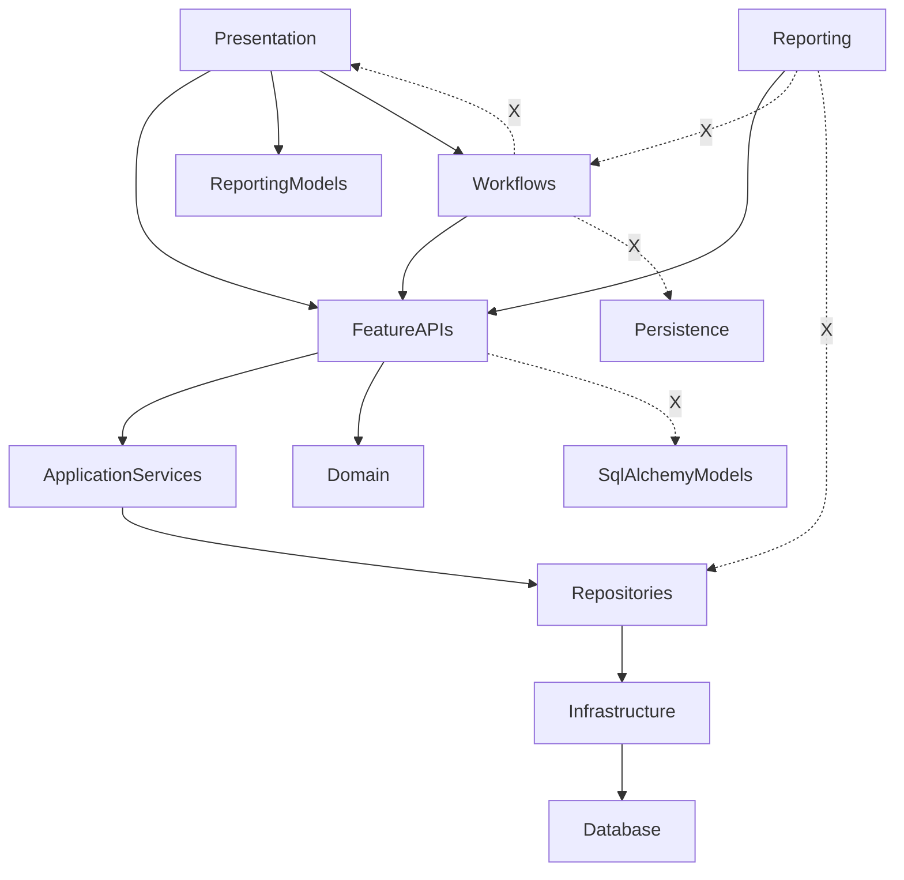

# RC-001A Architecture Audit

Date: 2026-07-17
Scope: Complete architecture audit without behavioral changes.

## Executive Summary

The architecture audit covered Presentation, Reporting, Workflows, Feature APIs, Capability boundaries, and Infrastructure dependency direction.

Verified outcomes:
- Presentation does not import repositories, persistence, or domain modules.
- Reporting does not import workflows or repositories.
- Workflows do not import GUI/presentation modules or persistence internals.
- Feature API contract tests (immutable request/response DTOs and response domain leakage checks) pass.
- No concrete circular import cycles were detected in exact-module static analysis.

Objective defect fixed:
- Architecture guard tests were still centered on the legacy gui package and did not enforce the active presentation package or explicit reporting/workflow boundaries. Guard rules were updated in test architecture checks.

## Dependency Graph

Legend:
- Solid arrow: allowed dependency direction.
- Dashed X arrow: forbidden dependency direction.

## Architectural Findings

### Critical

- None.

### High

1. Architecture guard drift vs current UI package structure (fixed)
- Area: dependency guard enforcement.
- Evidence: tests/architecture/test_dependency_guard.py was enforcing gui package assumptions and lacked explicit reporting/workflow boundary tests for this audit scope.
- Fix applied: dependency guard now includes active presentation package rules and adds explicit tests for reporting/workflow constraints.
- Risk if left unresolved: architectural regressions could pass unnoticed in CI.

### Medium

1. LOCKED capability boundary verification is only partially automated
- Evidence: architecture tests enforce layer boundaries, but there is no dedicated automated guard that validates capability-level LOCKED boundaries (for example cross-capability ownership leakage checks).
- Impact: boundary erosion risk remains possible across capability packages.

2. Duplicated workflow orchestration logic
- Evidence: repeated _upsert_project_references and repeated project-selection workflow steps across project onboarding workflows.
- Impact: bug-fix fan-out risk and consistency drift over time.

### Low

1. Dead code candidate in tests
- Evidence: tests/application/features/projects/test_project_features.py contains helper _service_create_response that has no call sites in that module.
- Impact: low, test-maintenance noise only.

2. Circular imports
- Evidence: static exact-module cycle scan over src found zero concrete cycles.
- Impact: none currently.

## Technical Debt

- Capability lock constraints rely mostly on documentation and conventions rather than dedicated executable guards.
- Validation/mapper style duplication is widespread in application feature and workflow layers.
- Mixed legacy/new package patterns (historical gui naming vs current presentation naming) require guard maintenance discipline.

## Recommended Backlog

1. Add capability-boundary architecture tests for LOCKED capabilities
- Enforce prohibited cross-capability ownership imports and non-reference coupling patterns.

2. Consolidate repeated project-workflow helper logic
- Extract shared orchestration helpers for reference upsert and project-selection steps.

3. Add dedicated dead-code scan in CI
- Integrate a dead-code tool (for example vulture) with a reviewed allowlist baseline.

4. Keep architecture guard synchronized with package topology
- Extend dependency guard when introducing new top-level architectural packages.
