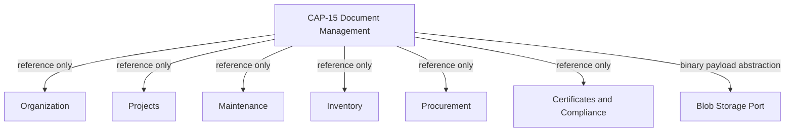

# CAP-15 Document Management

Status: LOCKED
Capability ID: CAP-15
Prefix: DOC

## Purpose
Document Management provides a dedicated bounded context for document archive metadata, version tracking, lifecycle governance, and reference-based attachment to other capabilities.

The capability owns only document aggregates and never owns foreign aggregates.

All cross-capability integration is identity/reference only.

## Ubiquitous Language
- Document: The aggregate root representing one logical managed document.
- DocumentVersion: Immutable child entity representing one concrete revision snapshot.
- DocumentLink: Child entity representing one attachment reference from a document to a foreign capability record.
- DocumentStatus: Lifecycle state of a document.
- Classification: Controlled value object for confidentiality and handling level.
- RetentionPolicyRef: Value object that points to a retention policy code and rule revision.
- ExternalBlobRef: Value object pointing to binary storage location and integrity metadata.
- LinkTarget: Value object containing target capability name and target identifier.
- Archive: State where document remains immutable but available for lookup.
- Dispose: State where document is logically closed according to retention policy.

## Domain Model

### 1. Aggregate Root
- Document

### 2. Child Entities
- DocumentVersion
- DocumentLink

### 3. Value Objects
- DocumentId
- DocumentNumber
- DocumentTitle
- DocumentStatus
- Classification
- RetentionPolicyRef
- ExternalBlobRef
- LinkTarget
- Checksum
- MimeType
- FileSize

### 4. Domain Events
- DocumentRegistered
- DocumentVersionAdded
- DocumentLinked
- DocumentUnlinked
- DocumentArchived
- DocumentRestored
- DocumentDisposed

## Aggregate Design
Single aggregate root rule:
- Only Document is an aggregate root in CAP-15.

Document owns:
- identity and metadata
- lifecycle status
- append-only version history
- link references to external capabilities
- retention policy references

Document does not own:
- Organization, Project, Maintenance, Inventory, Procurement, Certificate, or Compliance aggregates
- external lifecycle or status of linked records
- binary file storage infrastructure state

Document invariants:
- A document must have at least one version when activated.
- A new version must have a strictly increasing version number within one document.
- Links are unique by target capability and target identifier.
- Link targets are references only.
- Archive and Dispose are terminal governance actions per policy.

## Business Rules
1. Document links are reference-only and must never include foreign aggregate snapshots beyond minimal display metadata.
2. Document cannot mutate linked foreign records.
3. Version history is append-only; previous versions are immutable.
4. Disposed documents cannot receive new versions or new links.
5. Archive and Dispose operations require explicit reason metadata.
6. Retention policy is evaluated using explicit as-of date provided by caller.
7. Binary payloads are not persisted inside the domain aggregate; only ExternalBlobRef is stored.

## State Model
DocumentStatus in first implementation scope:
- DRAFT
- ACTIVE
- ARCHIVED
- DISPOSED

Allowed transitions:
- DRAFT -> ACTIVE
- ACTIVE -> ARCHIVED
- ARCHIVED -> ACTIVE
- ACTIVE -> DISPOSED
- ARCHIVED -> DISPOSED

Not allowed:
- DISPOSED -> any other state
- DRAFT -> DISPOSED

## Events
- DocumentRegistered: emitted when a new document aggregate is created.
- DocumentVersionAdded: emitted when a new immutable version is appended.
- DocumentLinked: emitted when a reference to external capability is attached.
- DocumentUnlinked: emitted when an existing reference is removed.
- DocumentArchived: emitted when lifecycle moves to ARCHIVED.
- DocumentRestored: emitted when lifecycle moves from ARCHIVED to ACTIVE.
- DocumentDisposed: emitted when lifecycle moves to DISPOSED.

Event boundaries:
- Events communicate document facts only.
- Events do not command foreign capabilities.

## Repository Contract
Repository interface (domain-facing contract):
- add(document)
- get_by_id(document_id)
- get_by_number(document_number)
- update(document)
- exists_by_number(document_number)
- list()
- list_by_status(status)
- search(criteria)
- list_links_for_target(target_capability, target_id)

Rules:
- Returns complete Document aggregates for command workflows.
- Query projections may be returned via dedicated query methods only.
- No ORM leakage outside infrastructure boundary.

## Application Services
Command use cases:
- RegisterDocument
- AddDocumentVersion
- LinkDocumentToTarget
- UnlinkDocumentFromTarget
- ArchiveDocument
- RestoreDocument
- DisposeDocument

Query use cases:
- GetDocument
- ListDocuments
- SearchDocuments
- ListDocumentsByTarget

Application constraints:
- One unit-of-work boundary per command.
- Validation and orchestration in application layer.
- Business invariants remain in domain aggregate.

## Feature API
Feature entry points follow the public API standard execute(request):
- RegisterDocumentFeature
- AddDocumentVersionFeature
- LinkDocumentFeature
- UnlinkDocumentFeature
- ArchiveDocumentFeature
- RestoreDocumentFeature
- DisposeDocumentFeature
- GetDocumentFeature
- ListDocumentsFeature
- SearchDocumentsFeature
- ListDocumentsByTargetFeature

DTO rules:
- Immutable request and response DTOs
- No domain objects in feature contracts
- Exception translation to application exception hierarchy

## Persistence Requirements
Storage model requirements:
- documents table for aggregate root metadata and lifecycle state
- document_versions table for append-only version entries
- document_links table for reference-only foreign links

Technical requirements:
- optimistic locking for document root updates
- unique index on document_number
- unique constraint on (document_id, version_number)
- unique constraint on (document_id, target_capability, target_id)
- indexes on status, created_at, archived_at, disposed_at
- indexes on (target_capability, target_id)

Binary storage requirements:
- Binary files stored outside aggregate persistence (file/object store)
- Aggregate stores only ExternalBlobRef, checksum, size, mime type metadata

Audit requirements:
- preserve created_by, created_at, updated_at
- preserve archival and disposal reason fields

## External Dependencies
Planned external dependencies through abstractions only:
- BlobStoragePort for binary payload put/get/delete policy operations
- VirusScanPort for optional pre-activation scan status
- Clock abstraction for deterministic as-of policy evaluation
- Identity reference validation through existing capability public APIs only

No direct repository access to foreign capabilities is allowed.

## Relationships To Existing Capabilities
Reference-only relationship policy applies to all capabilities below.

### Organization
- LinkTarget capability key: ORGANIZATION
- Example links: policy owners, committee approvals, correspondence records
- Ownership: Organization remains owner of organization and contact aggregates

### Projects
- LinkTarget capability key: PROJECTS
- Example links: project charter, milestone evidence, completion dossiers
- Ownership: Projects remains owner of project lifecycle and milestone state

### Maintenance
- LinkTarget capability key: MAINTENANCE
- Example links: work order evidence, maintenance reports, inspection artifacts
- Ownership: Maintenance remains owner of work orders and maintenance history

### Inventory
- LinkTarget capability key: INVENTORY
- Example links: stock adjustment proof, item safety sheets, movement evidence
- Ownership: Inventory remains owner of stock truth and movement state

### Procurement
- LinkTarget capability key: PROCUREMENT
- Example links: quotations, purchase order attachments, receipt evidence
- Ownership: Procurement remains owner of order lifecycle and receipt history

### Certificates and Compliance
- LinkTarget capability key: CERTIFICATES
- Example links: certificate scans, statutory annexes, inspection attachments
- Ownership: Certificates/Compliance remains owner of certificate validity and compliance state

## Dependency Diagram

## Planned Implementation Waypoints
- DOC-001: Domain model and aggregate tests
  - Define Document aggregate root, entities, value objects, and invariants.
- DOC-002: Persistence models and mapper tests
  - Add document ORM models and mapper with restoration-safe behavior.
- DOC-003: Repository contract and SQLite repository tests
  - Implement repository with optimistic locking and projection queries.
- DOC-004: Application services for commands
  - Register, version, link, unlink, archive, restore, dispose orchestration.
- DOC-005: Application services for queries
  - Get, list, search, list-by-target with DTO projections.
- DOC-006: Feature API layer and contract tests
  - Public execute(request) features and exception translation.
- DOC-007: End-to-end integration workflows and capability review
  - Full stack tests for lifecycle, linking, and cross-capability reference safety.
- DOC-008: Capability lock and documentation finalization
  - Lock checklist, architecture validation, and lock artifact publication.

## Architectural Constraints Summary
- CAP-15 owns only Document aggregate.
- CAP-15 integrates by references only.
- CAP-15 must not own or mutate foreign aggregates.
- CAP-15 must not expose infrastructure models through feature API.
