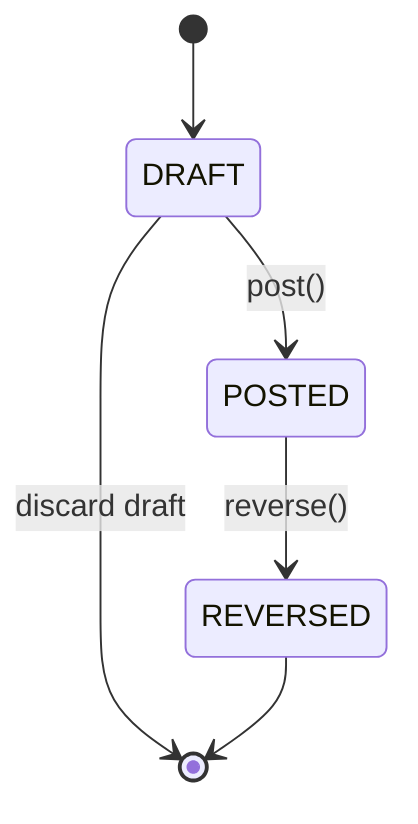
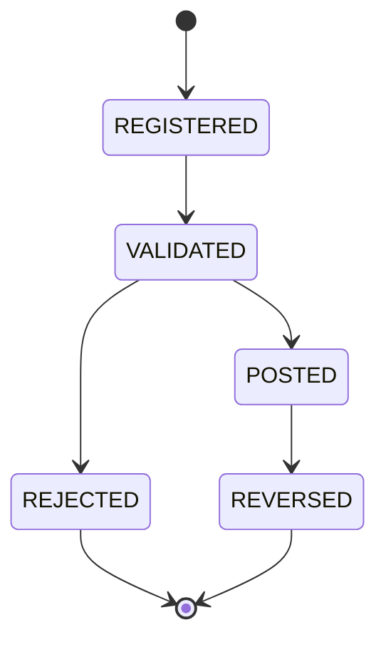
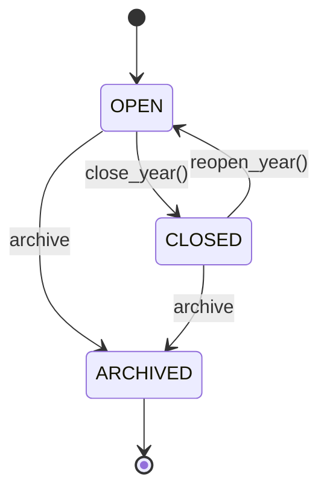

# CAP-16 Accounting

Status: LOCKED
Capability ID: CAP-16
Prefix: ACC

## 1. Purpose

### Business Purpose
Accounting provides the financial truth boundary for MFM Enterprise by owning:
- chart-of-accounts governance,
- double-entry journal recording,
- fiscal calendar controls,
- period and year close discipline,
- auditable balances and reporting-ready posting history.

This capability ensures financial events from operational capabilities are transformed into balanced, immutable accounting records under fiscal governance.

### Scope
CAP-16 owns:
- accounting master data (chart of accounts and ledger accounts),
- journal lifecycle (draft, posted, reversed),
- journal lines and posting semantics (debit/credit),
- fiscal year and fiscal period lifecycle,
- opening and closing balance governance,
- accounting references to source business documents and projects.

### Explicit Out-of-Scope
CAP-16 does not own:
- vendor/customer lifecycle,
- procurement order approval workflow,
- inventory valuation policy definition,
- asset operational lifecycle,
- document binary storage,
- project planning lifecycle,
- tax filing submission workflows,
- external BI/report engine infrastructure.

## 2. Ubiquitous Language
- Chart of Accounts: The governed structure of available ledger accounts for posting.
- Account: A ledger posting target defined by account number, type, and normal balance.
- Journal: Accounting record container (alias of journal entry aggregate) used for posting workflow.
- Journal Entry: Balanced accounting aggregate containing posting date, description, references, and lines.
- Journal Line: One immutable debit or credit line tied to one account and one amount.
- Fiscal Year: Aggregate defining accounting year boundaries and period governance state.
- Fiscal Period: Sub-window inside a fiscal year, open or closed for posting.
- Voucher: External or internal source identifier grouping one accounting transaction intent.
- Transaction: Business-financial event represented in accounting by a balanced journal entry.
- Balance: Net monetary result per account (debit/credit effect over time).
- Opening Balance: Starting account balances at fiscal year open.
- Closing Balance: Final account balances at fiscal year close, before carry-forward.
- Posting: Valid accounting amount on one side (debit or credit) for one line.
- Posting Date: Effective accounting date for fiscal period determination.
- Document Reference: Source-document identity reference (for example purchase order, invoice, certificate, document ID).
- Project Reference: Reference to project identity used for accounting traceability and allocation.
- Cost Center: Analytical allocation tag for financial control and reporting slices.
- VAT Code: Tax classification reference used to derive tax treatment and reporting categories.
- Currency: Money currency code used by accounting amounts; all lines in one journal entry share one currency.

## 3. Aggregate Roots

### ChartOfAccounts (existing)
Responsibilities:
- Own chart metadata, status (active/locked), and account membership.
- Enforce uniqueness and mutability constraints for account set maintenance.

Invariants:
- Chart name and version must be non-empty.
- Account number unique within chart.
- Duplicate account identity in chart forbidden.
- Locked chart cannot be modified.
- Account with postings cannot be removed.

Lifecycle:
- CREATED -> ACTIVE or INACTIVE
- ACTIVE/INACTIVE -> LOCKED (terminal for structure mutation)

### LedgerAccount (existing)
Responsibilities:
- Represent one postable ledger account with classification and balance semantics.
- Enforce account-level mutability and posting eligibility.

Invariants:
- Unique account number.
- Name non-empty.
- Account type and normal balance required.
- Locked account cannot be changed.

Lifecycle:
- CREATED -> ACTIVE or INACTIVE
- ACTIVE/INACTIVE -> LOCKED
- LOCKED can be explicitly UNLOCKED only by governance operation

### JournalEntry / Journal (existing)
Responsibilities:
- Represent one balanced accounting transaction.
- Control draft/post/reverse lifecycle.
- Maintain immutable posting facts once posted/reversed.

Invariants:
- At least two lines.
- Each line amount > 0.
- All lines use same currency.
- Total debit equals total credit.
- POSTED and REVERSED entries are not modifiable.

Lifecycle:
- DRAFT -> POSTED -> REVERSED
- DRAFT cannot reverse directly.
- REVERSED cannot be posted again.

### FiscalYear (existing)
Responsibilities:
- Own fiscal-year boundaries and fiscal-period coverage.
- Enforce one-open-year rule.
- Enforce period/year close and reopen policies.

Invariants:
- Valid date boundaries and continuous period coverage with no gaps/overlaps.
- Period numbers unique.
- Only one fiscal year open at a time.
- Year close allowed only when all periods are closed.
- CLOSED or ARCHIVED year cannot be mutated as open year state.

Lifecycle:
- OPEN <-> CLOSED
- OPEN/CLOSED -> ARCHIVED
- ARCHIVED is terminal.

## 4. Child Entities
- FiscalPeriod (inside FiscalYear aggregate boundary; lifecycle controlled by FiscalYear).

Note:
- JournalLine is modeled as immutable value object in current implementation and remains so in CAP-16.

## 5. Value Objects
- AccountNumber
- Posting
- JournalLine
- Money (reused from finance domain)
- PostingSide
- NormalBalance
- AccountType
- AccountGroup
- AccountCategory
- FiscalYearStatus
- JournalEntryStatus
- VoucherReference (planned)
- DocumentReference (planned)
- ProjectReference (planned)
- CostCenterCode (planned)
- VatCode (planned)

## 6. Domain Events
Current domain coverage has accounting invariants but no dedicated accounting event catalog yet. CAP-16 event model will define:
- ChartOfAccountsLocked
- LedgerAccountCreated
- LedgerAccountRenamed
- LedgerAccountLocked
- JournalEntryDrafted
- JournalEntryPosted
- JournalEntryReversed
- FiscalPeriodClosed
- FiscalPeriodReopened
- FiscalYearClosed
- FiscalYearReopened
- FiscalYearArchived
- OpeningBalanceRegistered
- ClosingBalanceFinalized

Event rules:
- Events publish accounting facts only.
- Events are append-only audit signals.
- Events never mutate foreign aggregates.

## 7. Repository Contracts
Domain-facing repository interfaces for CAP-16:

### ChartOfAccountsRepository
- add(chart: ChartOfAccounts) -> None
- get_by_id(chart_id) -> ChartOfAccounts | None
- get_active() -> ChartOfAccounts | None
- update(chart: ChartOfAccounts) -> None
- list() -> list[ChartOfAccounts]

### LedgerAccountRepository
- add(account: LedgerAccount) -> None
- get_by_id(account_id) -> LedgerAccount | None
- get_by_number(account_number: AccountNumber) -> LedgerAccount | None
- update(account: LedgerAccount) -> None
- list() -> list[LedgerAccount]
- list_active() -> list[LedgerAccount]

### JournalEntryRepository
- add(entry: JournalEntry) -> None
- get_by_id(entry_id) -> JournalEntry | None
- get_by_number(journal_number: str) -> JournalEntry | None
- update(entry: JournalEntry) -> None
- list() -> list[JournalEntry]
- list_by_reference(reference: str) -> list[JournalEntry]
- list_by_posting_date_range(start_date, end_date) -> list[JournalEntry]

### FiscalYearRepository
- add(fiscal_year: FiscalYear) -> None
- get_by_id(fiscal_year_id) -> FiscalYear | None
- get_by_year(year: int) -> FiscalYear | None
- get_open() -> FiscalYear | None
- update(fiscal_year: FiscalYear) -> None
- list() -> list[FiscalYear]

### BalanceRepository (query-focused)
- get_account_balance(account_id, as_of_date) -> Money
- get_trial_balance(fiscal_year_id, period_number | None) -> list[BalanceRow]
- get_opening_balances(fiscal_year_id) -> list[BalanceRow]
- get_closing_balances(fiscal_year_id) -> list[BalanceRow]

Repository rules:
- Return complete aggregates for commands.
- Keep analytical/report projections in query methods.
- Never leak ORM models beyond infrastructure boundary.

## 8. Capability Dependencies
CAP-16 depends on other capabilities by identity/reference only.
Dependency direction is from CAP-16 (consumer) to source capability (provider).

- Organization: CAP-16 -> Organization
  - Uses organization/contact identity for ownership and counterparty traceability.
- Projects: CAP-16 -> Projects
  - Uses project reference for tagging and allocation.
- Documents: CAP-16 -> Documents
  - Uses document reference for auditable posting evidence.
- Procurement: CAP-16 -> Procurement
  - Consumes procurement events/identities to produce accounting postings.
- Inventory: CAP-16 -> Inventory
  - Consumes stock and valuation references for accounting recognition.
- Assets: CAP-16 -> Assets
  - Consumes asset references for capitalization/depreciation postings.
- Membership: CAP-16 -> Membership
  - Consumes membership billing/enrollment references for journal generation.
- Reporting: Reporting -> CAP-16
  - Reporting consumes accounting truth; CAP-16 does not depend on reporting runtime.

Dependency constraints:
- No direct write into foreign aggregate stores.
- No ownership transfer across boundaries.
- References only in accounting records.

## 9. Business Rules
Core accounting invariants:

1. Double-entry bookkeeping
- Every transaction is represented by one journal entry with debit and credit effects.

2. Debit/Credit balancing
- Sum(debit) == Sum(credit) is mandatory before posting.

3. Closed fiscal periods
- Posting into closed periods is forbidden.

4. Journal posting
- Only valid DRAFT journal entries can be posted.
- Posting validates line count, amount positivity, currency consistency, and balance.

5. Immutable posted entries
- POSTED entries cannot be edited.
- Correction must use explicit reversing entry semantics.

6. Fiscal year closing
- Fiscal year can close only when all periods are closed.
- Closed fiscal year prevents normal mutation/posting until reopened by governance.

7. Account mutability
- Locked accounts/charts cannot be modified.
- Accounts with postings cannot be removed from chart.

8. Reference integrity
- Document, project, cost-center, and VAT references are optional by policy, but if present must conform to canonical reference format.

9. Currency consistency
- All lines in one journal entry must share one currency.

## 10. State Models

### Journal State

### Voucher State

### Fiscal Year State

## 11. Implementation Roadmap
- ACC-001 Domain
  - Finalize aggregate contracts, invariant coverage, and domain-event catalog.
- ACC-002 Persistence
  - Add ORM models, mappers, and persistence constraints for chart/journal/fiscal-year.
- ACC-003 Repository
  - Implement repository contracts with SQLite adapters and unit-of-work integration.
- ACC-004 Application
  - Add command/query use cases for posting, period controls, and closing workflows.
- ACC-005 Feature
  - Expose immutable feature DTO APIs with exception translation.
- ACC-006 End-to-End
  - Full-stack workflows for draft/post/reverse and fiscal close/reopen.
- ACC-007 Review
  - Capability architecture review, invariants review, and dependency conformance.
- ACC-008 Lock
  - Lock checklist, roadmap update, and release governance evidence.

## 12. Final Lock Status

ACC-008 lock status:
- Domain architecture: verified
- Persistence architecture: verified
- Repository implementation: verified
- Application services: verified
- Feature layer: verified
- End-to-end workflows: verified
- Dependency direction: verified
- Aggregate boundaries: verified
- Domain events: verified as documented/planned only
- Accounting invariants: verified
- Double-entry bookkeeping enforcement: verified
- Fiscal year lifecycle: verified
- Ledger account lifecycle: verified
- UnitOfWork usage: verified
- Test coverage: verified
- Dead code: no CAP-16 findings detected
- Unused imports: none detected in changed CAP-16 scope
- Ruff: passed on changed review file
- Full regression suite: passed

Conclusion: no implementation defect was proven in CAP-16; the closed-fiscal-year rejection behavior remains an accepted architectural constraint of the current public Feature API and is covered by end-to-end tests.

## Architectural Constraints Summary
- CAP-16 remains a DDD bounded context with aggregate-root ownership and strict invariants.
- Cross-capability integration is reference-only.
- No accounting rule bypass outside aggregate/application boundaries.
- Reporting consumes accounting outputs, not accounting internals.
